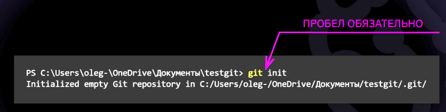

# This is my Git Tutorial

* *git init* - Команда, используемая для инициализации репозитория.

* *git add filename.extension* - Добавление конкретного файла к рассмотрению git. Добавляет содержимое рабочего каталога в индекс (staging area).

* *git commit -m"comment"* - Зафиксировать в коммите проиндексированные изменения (закоммитить), добавить сообщение.

* *git commit --amend -m"comment"* - Изменение содержимого сообщения последнего коммита.

* *git status* - Просмотреть статус нужного репозитория (текущее состояние гита, есть ли изменения, которые нужно закоммитить).

* *git log* - Просмотреть историю изменений, внесённых в репозиторий (журнал изменений). Добавив флаг *-p*, можно подробно изучить изменения. Нажатие *q* - выход в исходное окно терминала.

* *git checkout commitname* - Переключиться на коммит с указанным именем. Переключение между версиями.

* *git checkout master* - Вернуться в тот коммит, где работаем (переключиться на коммит, на который указывает master).

* *git diff* - Показывает разницу между текущим файлом и сохранённым.

* *git show commitname* - Просмотреть полный список изменений, внесённых конкретным коммитом.

* *git rm dirname/filename.extension* - Удалить файлы из текущего рабочего дерева. При этом файлы удаляются и из индекса.

* *git reset HEAD filename.extension* - Восстановить подготовленный файл рабочего дерева. Файл перейдёт в категорию не подготовленных к коммиту.

* *git revert HEAD* - Откатить последний коммит. Создастся новый коммит, содержащий обратные преобразования относительно предыдущего.

> **Примечание**: *Команда git revert отменяет изменения, записанные только одним коммитом. Она не откатывает проект к более раннему состоянию, удаляя все последующие коммиты, как это делает команда git reset.*
* * *
# Work with branches
* *git branch* - Команда отобразит все ветки, отметит текущую звёздочкой (*) и выделит её цветом.
1. Создание новой ветки и переходы между ветками
* *git branch branch_name* - Создание новой ветки, где *branch_name* - название ветки.
* Для перехода между ветками используется команда *git checkout branch_name*.
2. Слияние веток
* *git merge branch_name* - Команда для слияния веток.
3. Конфликты при слиянии и их разрешение
* Эта строка создана для демонстрации конфлитов.
* Конфликты при слиянии веток возникают при наличии в них противоречащих коммитов.
4. Итоги семинара
* * *
# This is my Markdown Tutorial

* \ - Экранирование служебных символов Markdown
* ** - Выделение текста жирным
* \* - Курсив
* ~ - Зачёркнутый текст
* \# - Заголовок первого уровня H1
* \## - Заголовок второго уровня H2
* \###### - Заголовок шестого уровня H6
* \> - Цитата (сноска)
* \*<пробел> - Ненумерованный список
* \1.<пробел> - Нумерованный список
* <пробел><пробел><пробел><пробел> или Tab - Блок кода
* \* * * или \*** или \------ - Горизонтальная линия
* \[ссылка](http://example.ru/) - Веб-ссылка без тайтла
* \[ссылка](http://example.ru/ "Тайтл") - Веб-ссылка с тайтлом
* \<http://example.ru/> - Безанкорная ссылка
* \![example]\(example.png) - Картинка